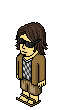
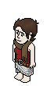
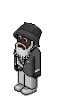

# Les Parrains de la Mafia-Habbo

Cette page conserve une version structurée du sujet officiel **« Hommage aux Anciens »**, publié sur le forum de la Mafia-Habbo.

[Consulter le sujet original « Hommage aux Anciens »](https://mafiahabbo.superforum.fr/t15694-hommage-aux-anciens)

Le document original présente, dans l'ordre chronologique de leurs règnes, les principaux dirigeants ayant marqué l'histoire de la Mafia-Habbo.

Le sujet original comprend des fiches allant de **Don Krapule** à **Don Redrem**.

Afin de couvrir l'ensemble de l'histoire de la Mafia-Habbo jusqu'à sa fermeture en 2021, **Don Gualtiero**, dernier Parrain de l'organisation, est ajouté à leur suite dans le même format à partir d'autres archives officielles du forum.

Le contenu issu du sujet **Hommage aux Anciens** est conservé dans son **ton d'origine**.

Les formulations, le vocabulaire, les jugements, les éléments de jeu de rôle et l'orthographe des descriptions originales sont donc volontairement préservés. La mise en forme a uniquement été adaptée au Markdown afin d'en faciliter la lecture et la conservation.

Pour replacer les différents règnes dans leur contexte historique :

[Histoire de la Mafia-Habbo](histoire.md)

---

## Repères essentiels

- **Premier fondateur et dirigeant :** Krapule
- **Création de la Mafia-Habbo :** 15 avril 2005
- **Dernier Parrain :** Gualtiero
- **Fermeture de la Mafia-Habbo :** 18 février 2021
- **Période couverte :** 2005–2021
- **Source principale :** sujet officiel *Hommage aux Anciens*
- **Nature du contenu :** histoire de l'organisation, souvenirs internes et biographies RP

La direction de la Mafia-Habbo ne constitue pas toujours une succession parfaitement linéaire.

Durant certaines périodes, plusieurs familles internes possèdent simultanément leur propre Don. Certains dirigeants reviennent également au pouvoir après une interruption et plusieurs intérims sont documentés.

---

## Contenu historique et jeu de rôle

Le sujet **Hommage aux Anciens** mélange volontairement :

- des informations historiques sur les joueurs et leurs fonctions ;
- des souvenirs et jugements portés par la Mafia-Habbo ;
- des biographies fictives ;
- des éléments de jeu de rôle.

Les mentions de :

- « véritable identité » ;
- professions ;
- assassinats ;
- activités criminelles ;
- dossiers Interpol ;
- lieux de résidence ;
- liens familiaux ;
- décès

font partie de l'univers **RP** lorsqu'elles apparaissent dans ces biographies.

Elles ne doivent pas être interprétées comme des informations concernant la vie réelle des joueurs.

Les pseudonymes Habbo et les fonctions exercées dans la Mafia-Habbo constituent en revanche des éléments historiques de l'organisation lorsqu'ils sont documentés dans ses archives.

---

## Conservation des illustrations

Lorsque les illustrations historiques du sujet original sont encore disponibles, une copie est conservée directement dans cette archive afin d'éviter de dépendre d'anciens hébergeurs d'images.

Les illustrations de **Don Leto** et **Don Kidvirus** n'ont pas pu être conservées.

Elles étaient générées à partir de leurs anciens personnages Habbo, aujourd'hui disparus, et aucune autre copie de ces images n'a été retrouvée dans les archives officielles consultées.

Aucune reconstitution ou image artificielle n'est utilisée pour les remplacer.

---

## Les dirigeants présentés

| Dirigeant | Période indiquée |
|---|---|
| Don Krapule | 2005 |
| Don Madfreddy | 2005 |
| Don Vitti | 2005–2006 |
| Don Leto | 2006 |
| Don Kidvirus | 2006–2007 |
| Dame Kallysto | 2006 |
| Don Giorgo | 2006 et 2008 |
| Dame YokiPeACh | 2007 |
| Don Luftkrawerk | 2007 |
| Don Hust | 2009 |
| Don Marccelo | 2008–2009 |
| Don Diabloelo2 | 2009–2010 |
| Don Medzo | 2010 |
| Don Sayc | 2010–2011 puis 2012 |
| Don Alshak | 2011 |
| Don Alessio | 2012 |
| Don Zero | 2012–2013 |
| Don Valtieri | 2013–2014 |
| Don Affondo | 2013–2014, intérim |
| Don Gemeni | 2015–2016 |
| Don Capablanca | 2016–2018 |
| Don Redrem | 2018–2020 |
| Don Gualtiero | 2020–2021 |

Cette chronologie doit être lue en tenant compte des changements de familles internes, des retours au pouvoir et des intérims détaillés plus bas.

Pour comprendre la fonction de Parrain et le rôle du Grand Conseil :

[Hiérarchie de la Mafia-Habbo](hierarchie.md)

---

## Hommage aux Anciens

> Les Dons de la Mafia-Habbo : personnages charismatiques et attachants pour certains, craints et détestés pour d'autres. Une chose est certaine, c'est qu'ils auront marqué l'histoire mafieuse.
>
> Voilà une petite présentation - dans l'ordre chronologique de leur règne - de ceux qui ont été les leaders de la MH. Ceux qui ont su innover pour faire avancer la famille ; ceux qui l'ont fait vivre et qui l'ont emmenée jusque là.

---

### Don Krapule

**Blaze :** *Le Vieux*  
**Autre(s) identité(s) :** K ou Papy K  
**Ennemi juré :** Norman  
**Époque :** 2005  
**Activités favorites :** Espionner les jeunots et arnaquer les bisounours

#### Description originale

Il est celui qui "en avait marre d'un hôtel pour bisounours" et qui "voulait devenir riche et puissant".

Le fondateur en personne de la Mafia-Habbo (au départ appelée Famille K).

L'instigateur et créateur en majeure partie du jeu de rôle auquel nous jouons aujourd’hui, nous, mafieux !

Et encore.. s'il n'avait fait "que" ça.

Ses idées vont du plus farfelu au plus original : on retrouve notamment l'Hôtel K, projet ambitieux à son nom pour satisfaire les pauvres habbos, HabboStreet, le célèbre jeu de traque et d'assassinat, HabboVille et son univers démocratique, ainsi que le défunt HabboMafia, site fan qui avait pour but d’informer le peuple sur les organisations de l’hôtel et l’actualité mafieuse…

Après tout, on dit souvent que les génies ont en eux un grain de folie.

Véritable légende, on peut dire que Krapule est un nom qui ne laisse pas indifférent. Il est connu de tous et beaucoup l’envient.

Les personnes qui ont eu la chance de travailler avec lui le qualifient d’agréable et de sympathique.

De vilaines rumeurs circulent à son sujet, comme quoi ce serait un staff ou même Norman lui-même !!

A l’heure actuelle, il est porté disparu, mais nous espérons son retour un jour.

Et qui sait… peut-être même reviendra-t-il avec un nouveau projet dément en tête !

**Détail :** On le croirait décédé, d’après son dossier à Interpol.

---

### Don Madfreddy

**Diminutif :** Mad  
**Époque :** 2005  
**Activités favorites :** Lire la gazette et faire visiter ses appartements

#### Description originale

On ne sait pas grand chose de lui, mais je vais tout de même tenter de vous éclairer un maximum sur ce mystérieux bonhomme.

Il a été le second de Papy Krapule. Le premier de l’histoire mafieuse d’ailleurs.

Toujours soutenu par sa fidèle canne, c’était un homme courtois qui aimait inviter les jeunes chez lui, à la *Madroom*.

Parfois, il lui arrivait d’avoir des anecdotes à leur raconter.

Il fut néanmoins écarté de la famille lors de la rupture de l’alliance entre la MH et la U$A.

Et pour cause, il s’était dangereusement rapproché de la Bling Bling Family (c’est en réalité un des grands amis des dirigeants, et surtout de Method).

Il offrait sa carte et son numéro à ceux avec qui il voulait prendre contact.

On le reconnaissait grâce à son rire très spécial... *héhéhéhéhéhéé* !

**Détail :** Il se maintient en vie quelque part, d’après son dossier à Interpol.

---

### Don Vitti

**Nom :** Vincent (pour les intimes)  
**Autre identité :** V  
**Époque :** 2005 / 2006  
**Activités favorites :** discuter autour d’une table en buvant un verre et modéliser le pixel (c’est un artiste dans ce domaine)

#### Description originale

Auteur de la fameuse bannière MH du forum, il fut le successeur de Don Mad.

Réputé pour être juste et impartial, il est aussi le propriétaire du Cactus Café, véritable boulevard dans le passé (qui avait même accueilli Norman une fois).

Marié à AdorisPareBalle, une journaliste reconnue, c’est lui qui détenait le record de longévité en tant que Parrain (approximativement un an), avant qu'un autre Don ne s’en empare.

On sait qu’il est très proche de Don Leto et de Dame Kally, ces trois-là formant un trio incontournable.

On les voyait souvent ensemble dans le temps.

Sa particularité est sa queue de cheval. Personne ne l’a jamais vu détacher ses cheveux !

Enfin, certains affirment que c’était la belle époque durant son règne...

On raconte beaucoup de bien de lui.

**Détail :** Il se trouverait quelque part dans HabboVille, d’après son dossier à Interpol.

---

### Don Leto

**Autre identité :** L  
**Époque :** 2006  
**Activités favorites :** discuter autour d’une table en fumant un bon cigare et piéger ses ennemis

#### Description originale

D’abord connu en tant que Bras-Droit de Don Vitti, c'est également l'un des fondateurs du mouvement Carotte (sous bidilune).

Don Leto fut sans doute le plus vicieux et le plus fourbe des Parrains de la MH.

Marié à Créolatine, il aimait magouiller dans l’ombre et concocter des plans tous plus sournois les uns que les autres contre ceux dont il n’avait aucune estime.

Il paraît « sage » au premier abord mais ne vous y méprenez pas !

Autoritaire et fin stratège, c’est sous son règne que s’est effectué le saccage de la U$A.

Avec Dame Kallysto, son amie et confidente, il dirigeait la Mafia-Habbo d’une main de fer, ne tolérant pas l’échec.

Cependant, le pouvoir a fini par lui monter à la tête (*la plupart des hommes au pouvoir deviennent des méchants* dixit Platon) et il a perdu la raison.

Détenteur de l’ancien forum, il a toujours gardé un contrôle, de près ou de loin, sur la famille... jusqu’au jour où Don Diablo, Don Medzo et leurs membres se séparèrent de lui, en repartant sur de bonnes bases.

Aujourd’hui, il vaut mieux s’en approcher avec prudence !

**Détail :** Il se trouverait actuellement aux Bahamas, d’après son dossier à Interpol.

---

### Don Kidvirus

**Diminutif :** Kid  
**Époque :** 2006 et 2007

#### Description originale

L’exemple même du père protecteur.

Il fut l’un des fondateurs de la Famille V, appelée ainsi en l’honneur de Don Vitti, dont il fut aussi le premier Parrain.

Il est chauve mais évitez d’aborder ce sujet en sa présence... il se pourrait qu’il le prenne mal !

Il aime le travail bien fait et les bosseurs qui s’investissent à fond dans la famille.

Assez discret et calme, il n’est pas très bavard, préférant débiter des paroles mûres et réfléchies plutôt que de parler inutilement.

Quand on le voit, on ne s’imagine pas que c’est un dangereux criminel, autrefois dirigeant de la Mafia-Habbo, tellement il sait être gentil et se montrer généreux.

Malgré ça, il semblerait qu’il ait un goût particulier en ce qui concerne la torture...

**Détail :** Fiché introuvable, d’après son dossier à Interpol.

---

### Dame Kallysto

**Diminutif :** Kally  
**Époque :** 2006  
**Activité favorite :** Se moquer des innocents

#### Description originale

Il s'agit de la première Dame de la famille.

Elle est, avec Don Kidvirus, son mentor, la fondatrice de la Famille V, dont elle fut d’abord le Bras-Droit.

Elle est fortement reconnaissable grâce à son code vestimentaire : du violet partout !

Même son fameux chapeau de cow-boy est violet.

Sadique comme personne, elle manie le fouet à la perfection et n’hésite pas à s’en servir au moindre dérapage.

Sa franche complicité avec Don Leto a forcé Don Diablo et Don Medzo à l’écarter de la famille également.

**Détail :** Décédée dans d'étranges circonstances, d’après son dossier à Interpol.

---

### Don Giorgo

**Blaze :** *Elvis*  
**Autre identité :** Arno600  
**Époque :** 2006 et 2008  
**Activités favorites :** escroquer les novices et draguer les minettes

#### Description originale

Successeur de Don Leto, il est l’un des premiers à avoir rejoint les rangs de la Mafia-Habbo, au temps de Papy Krapule !

Au départ, le grade de Consigliere a été instauré pour lui.

On le reconnaît facilement grâce à sa banane bleue (d’où son blaze).

Il porte des lunettes de soleil, aussi.

C’est un joueur. Il aime l’argent plus que les femmes !

Mais attention : il n’aime pas perdre !

Il adore lancer des vannes à tout va, surtout en réunion (et même dans les pires moments).

Lui et son ami Perceval sont comme des frères.

Ils étaient revenus à la tête de la MH suite à la destitution de Don Luft par certains Anciens.

**Détail :** Hébergé dans la région par la Mafia-Habbo, d’après son dossier à Interpol.

---

### Dame YokiPeACh

**Autre identité :** Incognito.K  
**Diminutif :** Yoki  
**Époque :** 2007

#### Description originale

Un cas spécial parmi les Dons de la Mafia-Habbo.

Elle rejoignit celle-ci en saccageant sa première famille (le Gen 13).

Après avoir formé un duo avec son frère, MoneyOfChristo, lorsqu’elle était Capo, elle reprit les rênes de la MH, jusqu’à lors en période de repos, sous l’identité du mystérieux et imposant Incognito.

En tant que personnage sévère et sérieux, elle veillait beaucoup à l’activité familiale et aimait innover sur certains points.

Je crois d’ailleurs me souvenir que la MH-Industry a justement été créée à cette époque, sous son règne.

Elle a toujours un bonnet sur sa tête, et on se demande souvent ce qu’il cache !

On sait aussi qu’elle distribue des dragibus aux gens qu’elle apprécie.

Serait tombée dans la farine quand elle était petite...

**Détail :** On la croit en Chine, d’après son dossier à Interpol.

---

### Don Luftkrawerk

**Blaze :** *Le Tyran*  
**Autre identité :** Matteo59  
**Diminutif :** Luft  
**Époque :** 2007

#### Description originale

Officiellement destitué, il n’en reste pas moins un Don qui a été là pour la Mafia-Habbo et qui l’a servie jusqu’au bout.

Il devint le Bras-Droit de Dame Yoki lorsque cette dernière « relança » la famille.

Il était toujours habillé décontracté.

Paradoxalement à son blaze, il laissait beaucoup de libertés à ses membres.

Les haut-gradés n’avaient pas à se plaindre de ce côté-là.

Peut-être en laissait-il trop, justement ?

Puisque c’est quasiment ces derniers qui dirigeaient. Et ce n’est pas exagéré !

Seulement, certains Anciens ont jugé bon de lui enlever son titre et de reprendre la famille en main.

Il paraît qu’il passe de temps en temps, sans qu’on s’en aperçoive...

**Détail :** Sa position actuelle est inconnue, d’après son dossier à Interpol.

---

### Don Hust

**Autre identité :** Hustler  
**Blaze :** *L’homme au bob*  
**Époque :** 2009

#### Description originale

Adepte de la zen attitude, il fut sans aucun doute l’un des Parrains les plus « cools » de la MH.

Il ne s’énervait que rarement et était très apprécié, de par sa justesse et son feeling avec les autres.

Particulièrement doué au Habbo Foot, il est le premier des Dons à être passé par toutes les étapes de la hiérarchie familiale.

Malheureusement, il dût abandonner ses fonctions suite à la découverte de ses problèmes cardiaques...

Il légua son bob à Ship, qui fut l'une de ses meilleures recrues.

Hier encore, il était en train de se dorer la pilule sous le soleil des tropiques !

**Détail :** Décédé d'un arrêt cardiaque, d’après son dossier à Interpol.

---

### Don Marccelo

**Époque :** 2008-2009  
**Surnom :** *Le Sage*

#### Description originale

Homme de confiance de Papy Krapule.

Capo puis Parrain de la Mafia-Habbo, neuvième chef de la Famille K.

Digne successeur des Anciens.

Toujours sérieux en public, c'est le premier mafieux de la seconde génération à devenir Don.

Déchu de son titre en septembre 2014 suite à la Dissolution du Conseil des Aînés.

**Détail :** Casquette grise et à son teint pâle.

---

### Don Diabloelo2

**Véritable identité :** Diablo Milano  
**Époque :** 2009-2010  
**Blaze :** *L'épinard*

#### Description originale

Bras-Droit de Don Marccelo puis Parrain de la Mafia-Habbo, dixième chef de la Famille K.

Accepte de devenir le Bras-Droit de Don Alexis en 2012 puis celui de Don Sayc la même année.

Déchu de son titre en septembre 2014 suite à la Dissolution du Conseil des Aînés.

**Détail :** Ses cheveux verts.

---

### Don Medzo

**Véritable identité :** Frank Washington Lucas  
**Époque :** 2010  
**Surnom :** *Medzo Double Zero*

#### Description originale

Alors qu’Obama fut élu premier Président noir des Etats-Unis, Don Medzo fut le premier Parrain noir de la Mafia-Habbo !

Il est sage, modéré, blagueur et se prend rarement la tête : on voit bien qu’il était proche de son vieil ami, Don Hust, et qu’il a été son Bras-Droit.

Il participa grandement à la séparation entre la MH et les Anciens qui la contrôlaient dans l’ombre.

Il fut d’abord un gangsta, faisant à l’origine partie de la Compton, puis décida par la suite de fonder sa propre famille (la Inglewood), aidé de Nyto, une de ses vieilles connaissances.

Rapidement, les deux laissèrent tomber, convaincus que les affaires ne marcheraient pas, et rejoignirent donc la Mafia-Habbo.

Seul Medzo resta attaché à celle-ci !

Et il fit son chemin jusqu’à devenir un des leaders de la famille.

Il représente à ce jour le dernier Don de la Famille V.

**Détail :** Se repose sur une des îles du Pacifique, d’après son dossier à Interpol.

---

### Don Sayc

**Autre identité :** Khaegar  
**Époque :** 2010-2011 puis 2012  
**Surnom :** *-*

#### Description originale

Homme de confiance puis Bras-Droit de Don Diablo.

Parrain de la Mafia-Habbo, onzième chef de la Famille K.

Fondateur de la Famille Hust.

Dépoussière les pré-tests et crée le système des entretiens.

Règne de nouveau en 2012 sous Maleico.

Déchu de son titre en septembre 2014 suite à la Dissolution du Conseil des Aînés.

---

### Don Alshak

**Autre identité :** Eritro  
**Époque :** 2011  
**Surnom :** *-*

#### Description originale

Capo de Don Diablo puis fidèle Bras-Droit de Don Sayc.

Parrain de la Mafia-Habbo, douzième chef de la Famille K.

Co-fondateur de la Famille Hust.

Signe un retour remarqué à l'été 2010 sous Ertiro.

Notamment reconnu pour son sens de la diplomatie.

Déchu de son titre en septembre 2014 suite à la Dissolution du Conseil des Aînés.

---

### Don Alessio

**Véritable identité :** Mr-AlexiS, dit Alessio Milano  
**Blaze :** *La Tombe* — appelé « Señor Cuaba » par la presse  
**Époque :** 2012  
**Activités favorites :** fumer plusieurs cigares d'affilée et participer aux débats intéressants

#### Description originale

On aura rarement vu un mafieux plus passionné des cigares que cet homme-là.

Capable de reconnaître n'importe quelle marque d'un seul coup d'oeil, il a mis au point une méthode d'assassinat redoutable... le cigare piégé !

Des explosifs en passant par les empoisonnés, il les offrait à tous ceux qui lui causaient du tort (et avec un sourire si naturel que jamais l'on ne pourrait deviner ses intentions).

A la fois cubain et italien, Don Alessio était quelqu'un de très RPG, et bien qu'il ne parle pas beaucoup, aussi modéré que la plupart de ses prédécesseurs.

Après avoir été le Bras-Droit de Don Alshak, il sut mener la MH, pourtant pas en grande forme, à bon port.

Personnalité connue de tous à Miami dont il a récemment été élu Gouverneur.

On raconte qu'il aurait un jour crevé l'oeil d'un ripou qui aurait osé lui enlever le précieux de la bouche..

A éviter absolument !!

C'est le cinquième Don à être passé par toutes les étapes de la hiérarchie familiale.

**Détail :** Il se serait installé quelque part en Floride, d'après son dossier à Interpol.

---

### Don Zero

**Véritable identité :** Il serait peut-être d'origine britannique  
**Blaze :** *Zero K*  
**Époque :** 2012/2013  
**Activités favorites :** construire des pièces luxueuses et gérer son business dans l'ombre

#### Description originale

Don Zero, comme on l'appelle simplement aujourd'hui.

Plusieurs sources affirment qu'il a volontairement fait effacer toute trace de son état civil, et donc de la paperasse administrative qui permettait de l'identifier, afin de ne plus être inquiété.

Cible privilégiée du fisc, il a su, comme les nombreux Parrains avant lui, passer entre les mailles du filet nommé justice (grâce notamment à la très grande discrétion dont il sait faire preuve et qu'il affectionne particulièrement).

Libéré ainsi des poursuites qui le menaçaient, il s'est imposé comme le patron de sa propre société, la fameuse Kompany.

L'homme aussi froid dit-on que la plus glaciale des tempêtes a réussi, avec l'aide de ses collaborateurs, à relancer l'économie familiale.

On sait également qu'il est un architecte convaincu.

C'est le sixième Don à être passé par toutes les étapes de la hiérarchie familiale.

**Détail :** Il résiderait non loin d'HabboVille, d'après son dossier Interpol.

---

### Don Valtieri

**Véritable identité :** Lino Vitulli  
**Blaze :** *L'Iceberg*  
**Époque :** 2013/2014  
**Activités favorites :** Faire du chantage au Diable, comploter contre le monde entier, couper des têtes et non des doigts, jouer aux échecs, manipuler ses ennemis comme des marionnettes, renverser des gouvernements, spéculer en bourse (et gagner beaucoup, beaucoup d'argent), réciter des discours de Churchill et Reagan.

#### Description originale

Officiellement ex-milliardaire en lingot et banquier de renommée internationale, Lino Vitulli aura eu une carrière tumultueuse, parsemée de complots, de manigances, et d'obstacles en tout genre, obstacles qu'il aura toujours surmontés à l'aide de son intellect peu commun et de son sang-froid légendaire.

Joueur d'échecs particulièrement doué, on raconte, dans les bars les plus mal-famés contrôlés par la Mafia-Habbo, qu'il prenait un malin plaisir à défier les membres ayant commis une faute grave dans une partie -perdue d'avance-, leur promettant la vie sauve s'ils gagnaient, avant de les exécuter sans l'ombre d'un remord.

Il ne prendra sa retraite qu'après avoir redressé la famille, qu'on lui avait laissé dans un piètre état, et avoir réglé de nombreux problèmes.

En effet, faisant preuve d'un courage et d'une détermination extraordinaire, il prendra la décision d'exclure du RPG la famille Sacra Corona Unita, ainsi qu'écarter les anciens Dons qui s'étaient octroyés des pouvoirs illégitimes au fil du temps.

Autant aimé que détesté (et il était vraiment, vraiment détesté, c'est dire à quel point il était aimé), il restera l'un des Parrains les plus marquants de la famille.

On raconte qu'il était à la tête d'une loge maçonnique secrète à l'intérieur même de la famille.

Une statistique a également montré qu'environ 90% des informations qui circulent sur l'hôtel ont été créées et inventées par ses soins pour manipuler et désinformer ses ennemis, et les amener là où il le veut sans qu'ils ne s'en rendent compte.

C'est le septième Don à être passé par toutes les étapes de la hiérarchie familiale.

C'est à la fois le dix-huitième et vingtième Don de la Mafia-Habbo, puisque Don Affondo, dont la véritable identité reste un mystère complet, a assuré l'intérim à la tête de la famille pendant près de trois mois, faisant de lui le dix-neuvième Don de la MH, avant que Don Valtieri ne se réveille du coma dans lequel il avait été plongé suite à une tentative d'assassinat et ne retourne sur le trône.

**Détail :** D'après son dossier à Interpol, Don Valtieri résiderait actuellement en Irlande, son téléphone toujours sous la main en cas de besoin.

---

### Don Affondo

Le sujet **Hommage aux Anciens** ne consacre pas de fiche indépendante à Don Affondo.

Il est toutefois explicitement mentionné dans la fiche de Don Valtieri.

**Fonction :** Parrain intérimaire  
**Position dans le récit du sujet :** dix-neuvième Don de la Mafia-Habbo

#### Mention originale

> Don Affondo, dont la véritable identité reste un mystère complet, a assuré l'intérim à la tête de la famille pendant près de trois mois, faisant de lui le dix-neuvième Don de la MH, avant que Don Valtieri ne se réveille du coma dans lequel il avait été plongé suite à une tentative d'assassinat et ne retourne sur le trône.

---

### Don Gemeni

**Véritable identité :** Giorgio Milano  
**Blaze :** *L'Énigme*  
**Époque :** 2015/2016  
**Activité favorite :** Déguster des oranges

#### Description originale

Ses secrets sont bien gardés, si bien qu'il est considéré comme l'un des plus grands mystères du monde mafieux.

La légende voudrait qu'il n'ait jamais montré ne serait-ce qu'une seule émotion, que vous soyez son meilleur ami ou son pire ennemi.

Il est indéniablement impassible.

Il a été, fut un temps, à la tête d'un café qui portait le nom de « l'Oranger ».

Son affaire tournait si aisément que le fisc a fini par y fourrer son nez.

Le local a été fermé quelques jours après la visite des agents chargés du dossier.

Ils auraient été pendus à un oranger en guise de représailles.

Il est le 8ème Don a être passé par tous les grades de la famille et le 21ème Don de l'histoire de la Mafia-Habbo.

**Détail :** D'après son dossier à Interpol, il coule une retraite paisible en Chine.

---

### Don Capablanca

**Véritable identité :** Umberto Mephisto Galante  
**Blaze :** Le Cavalier  
**Époque :** 2016/2018  
**Activité favorite :** Être cool

#### Description originale

« Les idées sont à l'épreuve des balles. »

Voilà une citation qui pourrait résumer le parcours de Don Capablanca.

Véritable chef de file, il parvient toujours à exhorter ses camarades pour que ceux-ci l'accompagnent dans le rayonnement de la Famille.

De nombreuses réformes ont été menées durant son mondat comme par exemple l'ajout du grade de Malfaiteur - nouveauté historique puisque la hiérarchie de la MH n'avait jamais été modifiée depuis sa création - et un changement radical dans le système si vieillissant des associés.

L'initiative de rétablir La Kompany, d'y rattacher un site tout en y instaurant des branches fortes émergent de son esprit.

Il est le père de Renardeau, mascotte officielle de La Kartouche, journal qu'il a crée en s'entourant des plumes les plus piquantes du RPG.

Sous son règne, les victoires furent nombreuses dont le sigle de la Winchester et de la Bjork-Family en l'espace de quelques mois seulement.

Il est l'un des Parrains les plus marquants de l'histoire par ses traits d'esprit qui ont amusé une bonne partie de l'hôtel, son savoir unique qui permettait aux clients du Divino de ne jamais s'ennuyer, son dégoût avéré de l'échec, son pragmatisme mais aussi une petite part de folie.

Cette dernière l'a parfois poussé à croire en l'inimaginable, parfois à tort, parfois à raison.

Il laisse en tout cas un souvenir impérissable, celui d'un homme qui n'a qu'une foi : la Mafia-Habbo.

Il est le 9ème Don a être passé par tous les grades de la famille et le 22ème Don de l'histoire de la Mafia-Habbo.

**Détail :** Il coulerait une retraite paisible du côté d'Amsterdam d'après son dossier Interpol.

---

### Don Redrem

**Véritable identité :** Raffaele Milano  
**Blaze :** Le Colonel  
**Époque :** 2018/2020  
**Activité favorite :** Beer pong

#### Description originale

Anciennement Lord-Byron, Don Redrem a intégré les rangs de la Mafia-Habbo en 2011.

Archétype du Parrain qui apprécie la proximité avec ses membres, il n'hésite pas à se rendre disponible pour quiconque rencontre un problème et à le résoudre.

C'est sous son règne que la Bjork-Family ferme ses portes après un énième sigle orchestré par la Mafia-Habbo.

La famille connaît par la suite une vague de changements importants quant à ses locaux : le Divino obtient un agrandissement ainsi qu'un balcon, le Havana est reconstruit sous une forme pyramidale, le Grand Palace est détruit pour être remplacé par le Salle de Cérémonie et une Rue du nom d'Alessio Milano voit le jour.

Le Colonel milite pour l'instauration d'escouades au sein de la famille, véritable bouleversement hiérarchique qui apportera à la Mafia-Habbo la puissance de feu nécessaire pour confirmer sa prise de pouvoir total sur le RPK (cf Bataille Finale).

Il fut aussi l'un des rares Parrains à donner sa confiance à autant de Capi au cours de son règne, on compte pas moins de 5 intronisations durant son mandat qui dura un peu plus de deux ans et aucune défaite pour autant, ce qui démontre sa faculté à cerner ses hommes.

Il est le 10ème Don a être passé par tous les grades de la famille et le 23ème Don de l'histoire de la Mafia-Habbo.

**Détail :** Coule une retraite paisible dans son chalet en Suisse.

---

### Don Gualtiero

**Véritable identité :** Frederico Gualtiero Milano  
**Blaze :** Double-Face  
**Époque :** 2020-2021

#### Description

Gualtiero appartient à la dernière génération du Grand Conseil de la Mafia-Habbo.

Il succède à **Don Redrem** à la tête de la famille en **avril 2020**.

Sous son règne, le grade de **Crapule**, supprimé lors de la réforme hiérarchique de 2019, est notamment réintroduit le **3 mai 2020**.

Il demeure le dernier Parrain de la Mafia-Habbo jusqu'à sa fermeture officielle le **18 février 2021**.

Son personnage RP, **Frederico Gualtiero Milano**, est connu sous le blaze de **Double-Face**.

Dans les archives de la Mafia-Habbo, il est décrit comme un personnage dont la personnalité aurait progressivement sombré dans la folie, différentes rumeurs RP attribuant cette transformation à une arme bactériologique, au meurtre de sa famille ou simplement à une instabilité présente depuis toujours.

Contrairement aux fiches précédentes, cette présentation ne provient pas directement du sujet *Hommage aux Anciens*. Elle est reconstituée à partir d'autres documents publiés sur le forum officiel de la Mafia-Habbo afin de couvrir la dernière période de l'organisation.

---

## Une succession qui n'est pas toujours linéaire

L'histoire des dirigeants de la Mafia-Habbo n'est pas une succession parfaitement linéaire sur toute la période **2005–2021**.

Durant certaines périodes :

- plusieurs familles internes possèdent leur propre Don ;
- certains anciens dirigeants reviennent au pouvoir ;
- des intérims existent ;
- certains règnes se chevauchent entre différentes branches.

C'est notamment le cas durant les premières années, lorsque les **Familles K et V** possèdent parfois chacune leur propre dirigeant.

Le cas de **Valtieri** illustre également cette particularité : son règne est interrompu par l'intérim de **Don Affondo**, avant son retour à la tête de la famille.

Une personne peut donc apparaître comme le dirigeant d'une branche interne sans nécessairement constituer l'unique dirigeant de l'ensemble de la Mafia-Habbo à cette période.

La liste présentée sur cette page doit être comprise comme une conservation des dirigeants reconnus dans les archives de la Mafia-Habbo, et non comme une succession unique comparable à celle d'une organisation ayant toujours possédé une seule branche.

Pour comprendre le fonctionnement des différentes branches :

[Familles liées à la Mafia-Habbo](familles.md)

---

## Source principale

### Hommage aux Anciens

Forum officiel de la Mafia-Habbo :

[Consulter le sujet « Hommage aux Anciens »](https://mafiahabbo.superforum.fr/t15694-hommage-aux-anciens)

Cette source constitue avant tout un **document mémoriel interne**.

Elle mélange :

- histoire de l'organisation ;
- souvenirs de membres ;
- jugements sur les différents dirigeants ;
- humour ;
- éléments de jeu de rôle ;
- biographies fictives.

Elle doit donc être lue comme une archive de la manière dont la Mafia-Habbo présentait elle-même ses anciens dirigeants, et non comme une série de biographies réelles des joueurs.

Les informations complémentaires concernant **Don Gualtiero** proviennent également de documents publiés sur le forum officiel de la Mafia-Habbo.

Pour consulter la méthodologie générale utilisée par cette archive :

[Sources et méthodologie](sources.md)

---

## Voir aussi

- [Histoire de la Mafia-Habbo](histoire.md)
- [Hiérarchie et fonctionnement](hierarchie.md)
- [Saccages et Vendettas](saccages.md)
- [Familles liées à la Mafia-Habbo](familles.md)
- [Grands événements](evenements.md)
- [Sources et méthodologie](sources.md)

**Ad Vitam Æternam.**
